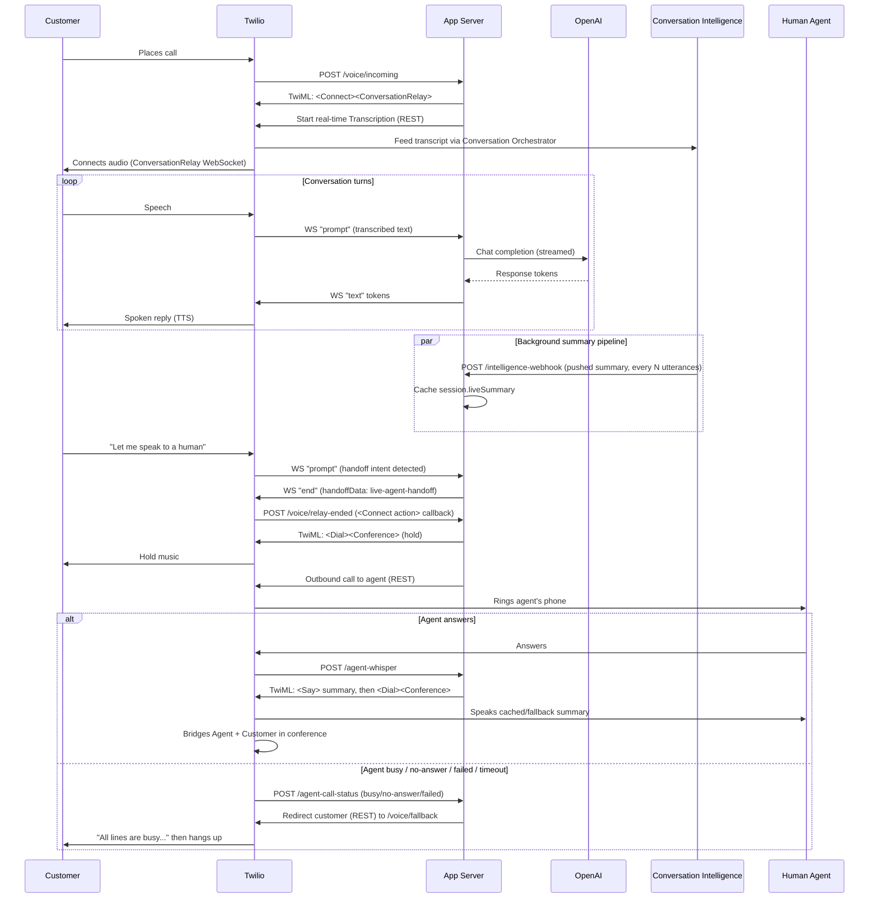

# ConvoRelay POC

AI voice agent built on Twilio ConversationRelay + OpenAI, with real-time Conversation
Intelligence call summaries and a conference-based warm transfer to a human PSTN agent.

## Overview

A customer calls a Twilio number and talks to an OpenAI-powered voice agent in real
time over Twilio ConversationRelay (Twilio handles speech-to-text and text-to-speech;
this app just exchanges text with OpenAI over a WebSocket). In the background, Twilio
Conversation Intelligence continuously summarizes the call and pushes updates to this
app. When the customer asks for a human, the app puts them on hold music, dials a human
agent, plays that agent a spoken whisper of the latest summary so they have instant
context, then bridges agent and customer together in a conference. If the agent doesn't
pick up, the customer hears a busy message instead and the call ends cleanly.

## System interactions

## Setup

1. `npm install`
2. Copy `.env.example` to `.env` and fill in:
   - `TWILIO_ACCOUNT_SID` / `TWILIO_AUTH_TOKEN`
   - `TWILIO_PHONE_NUMBER` — your Twilio voice number
   - `AGENT_PSTN_NUMBER` — the human agent's phone number for warm transfer
   - `OPENAI_API_KEY`
   - `PUBLIC_HOSTNAME` — your ngrok hostname, filled in after step 3
3. Start a tunnel: `ngrok http 3000`, copy the `https://<subdomain>.ngrok-free.app`
   hostname (no `https://` or trailing slash) into `PUBLIC_HOSTNAME` in `.env`.
4. Optional: `node scripts/setup-intelligence.js` to provision the real-time summary
   pipeline (see below), then paste its output `TWILIO_CONVERSATION_CONFIG_ID` into
   `.env`. Skip this and leave it unset to always use the OpenAI-generated fallback
   summary instead.
5. In the Twilio Console, set your phone number's "A call comes in" webhook to
   `https://<subdomain>.ngrok-free.app/voice/incoming` (HTTP POST).
6. `npm start`

## Customizing the brand

The voice agent's persona and greeting are swappable without touching code, so the same
architecture can be re-skinned per demo:

- `BRAND_PROMPT_FILE` — path to a text file with the brand's identity/tone/scope. See
  `prompts/default.txt` (generic) and `prompts/owl-shoes.txt` (example). This is composed
  with fixed voice-formatting and safety/handoff rules in `server.js` — those stay the same
  regardless of brand, since they're load-bearing for how the app works, not brand voice.
- `AGENT_GREETING` — the spoken greeting when ConversationRelay answers the call.

Add a new `prompts/<brand>.txt` file and point `BRAND_PROMPT_FILE` at it (plus set
`AGENT_GREETING`) to switch brands; no restart-time code changes needed.

## Prerequisites on your Twilio account

- **ConversationRelay** requires onboarding (Console > Voice > ConversationRelay) — not
  instant on a new account.
- **Real-time Conversation Intelligence** (step 4 above) is optional and provisions three
  resources via API: a Memory Store, an Intelligence Configuration (Summary operator,
  fires every 2 utterances, pushes results to a webhook), and a Conversation Orchestrator
  Configuration linking them for per-call ingestion. Re-run the script if your ngrok
  hostname changes, since the webhook URL is baked in at creation time.

## How the live summary works

Conversation Intelligence's Language Operators are triggered by rules — `COMMUNICATION`
(fires per utterance, or every N via `parameters.count`), `CONVERSATION_INACTIVE`, or
`CONVERSATION_END` — and results are *pushed* to a webhook you register, not fetched
on demand. There's no "give me a fresh summary right now" endpoint.

So this app runs the Summary operator continuously in the background (every 2 utterances)
and caches whatever it last received (`session.liveSummary`) as the call progresses. When
a transfer triggers, it reads that cached value instantly — no waiting, no polling. If
nothing has been pushed yet (a short demo call may not produce 2 utterances before you
ask for a transfer, or `TWILIO_CONVERSATION_CONFIG_ID` isn't set), it falls back to a
direct OpenAI completion over the transcript this app already buffered in memory.

Mechanically, per call:

1. `POST /voice/incoming` starts a real-time Transcription via the REST API (not TwiML
   `<Start>`, for full control) with `conversationConfiguration` set, which feeds
   Conversation Orchestrator → Conversation Intelligence.
2. The app polls `GET https://intelligence.twilio.com/v3/Conversations?channelId=<CallSid>`
   briefly to learn the resulting `conversationId`, and maps it back to the CallSid — the
   webhook push only carries `conversationId`, not CallSid. This is a raw `fetch()` call,
   not the `twilio` SDK: the installed SDK version only generates `client.intelligence.v2`
   with no resource methods, so the v3 control-plane surface (Conversations, Configurations,
   Operators, Memory Stores) has to be called directly over REST — see
   `scripts/setup-intelligence.js` for the same pattern.
3. `POST /intelligence-webhook` receives each pushed Summary result and caches it on the
   in-memory session, keyed via that mapping.
4. On transfer, `session.liveSummary` (or the OpenAI fallback) becomes the whisper text.

## Testing

1. Call your Twilio number. The AI should respond using OpenAI.
2. Say "let me speak to a human" (or "transfer me" / "speak to a manager"). You should
   be put on hold music while the app dials `AGENT_PSTN_NUMBER`.
3. Answer the agent's phone — you should hear the summary read aloud, then be bridged
   into the conference with the caller.
4. To test the no-answer fallback, let the agent call ring out or reject it — the
   caller should hear "All lines are currently busy..." and the call should end cleanly.

## Notes

- This POC does not validate Twilio's webhook signatures — every endpoint trusts
  incoming requests as-is. Do not deploy this beyond local/demo use without adding
  that back.
- Session state lives in an in-memory `Map` (`activeSessions`), matching the PRD's POC
  scope. It is not persisted and does not survive a server restart mid-call.
- The pre-built Summary operator ID is a platform-wide constant
  (`intelligence_operator_01kcv35pnkeysaf6z6cqtbpegn`); if it doesn't work on your
  account, list your available operators (`GET
  https://intelligence.twilio.com/v3/ControlPlane/Operators` — again raw REST, not the
  SDK) and override `TWILIO_SUMMARY_OPERATOR_ID` before running the setup script.
