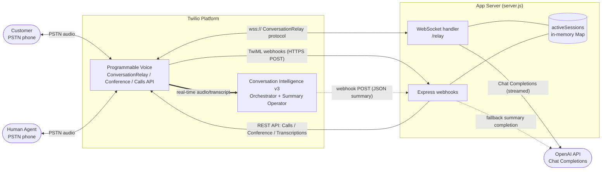
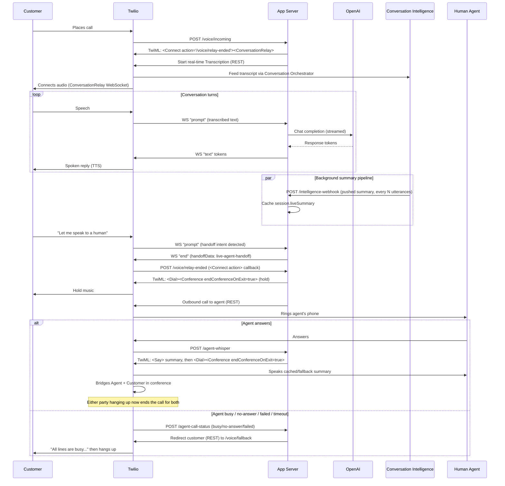

# Architecture

Two diagrams of the live-call runtime: the components and how data moves between them, and
the step-by-step sequence of a single call including the warm transfer and fallback.

## Integration diagram

Components and data flow during a call — who talks to whom, and over what protocol.

Notes:

- **`Voice <--> WS`** is the ConversationRelay WebSocket: inbound `setup`/`prompt`/`interrupt`/
  `dtmf`/`error`, outbound `text`/`play`/`sendDigits`/`language`/`end`.
- **`Voice --> Webhooks`** covers every TwiML fetch: `/voice/incoming`, the `<Connect action>`
  callback `/voice/relay-ended`, `/agent-whisper`, `/voice/fallback`, and the status callback
  `/agent-call-status`.
- **`Webhooks --> Voice`** covers outbound REST calls: starting/stopping the real-time
  Transcription, and placing the outbound call to the human agent.
- **`Voice ==> CI`** is one-directional and asynchronous: Twilio feeds the live transcript into
  Conversation Orchestrator on its own, independent of the request/response cycle above it.
- **`Sessions`** is plain in-memory state (`activeSessions`), not a separate service — drawn
  as its own node because both the webhook handlers and the WebSocket handler read/write it.

## Sequence diagram

A single call end-to-end: greeting, the OpenAI conversation loop, the background summary
push, the warm transfer handoff, and both branches of the agent-availability outcome.

